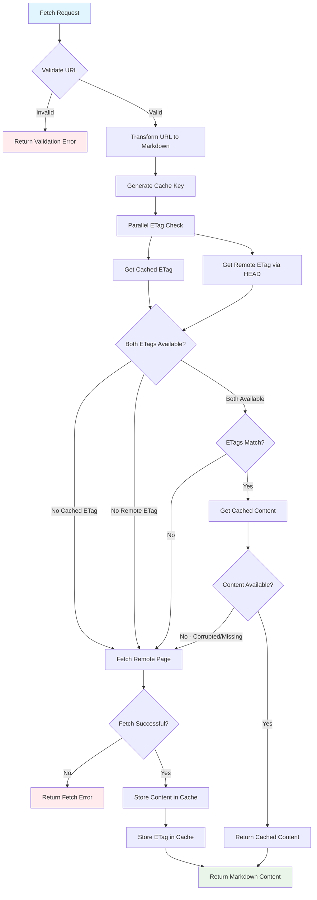

# FetchDocPage Tool

## Overview

The `fetchDocPage` tool fetches complete documentation pages from AWS Lambda Powertools documentation and returns them as markdown content. It implements an intelligent caching strategy using HTTP ETags to minimize network requests while ensuring users always receive up-to-date content. This tool is designed to work in conjunction with the `searchDocs` tool - first search for relevant pages, then fetch their complete content for detailed information.

## Features

- **Markdown Content Retrieval**: Fetches raw markdown content from documentation pages
- **Intelligent ETag Caching**: Uses HTTP ETags for efficient cache validation
- **Persistent File Cache**: Stores content locally using `cacache` for fast retrieval
- **URL Validation & Transformation**: Automatically converts page URLs to markdown source URLs
- **Security Controls**: Restricts fetching to authorized Powertools documentation domains
- **Timeout Protection**: Prevents hanging requests with configurable timeouts
- **Error Recovery**: Comprehensive error handling with detailed logging

## Parameters

### Required Parameters

| Parameter | Type     | Description                                     | Example                                                              |
| --------- | -------- | ----------------------------------------------- | -------------------------------------------------------------------- |
| `url`     | `string` | Valid Powertools for AWS documentation page URL | `"https://docs.powertools.aws.dev/lambda/python/2.1.0/core/logger/"` |

### URL Validation Rules

The tool enforces strict URL validation to ensure security and compatibility:

1. **Domain Restriction**: Must be from `docs.powertools.aws.dev`
2. **Runtime Validation**: Must include a valid runtime (`python`, `typescript`, `java`, `dotnet`)
3. **Version Format**: Must be semantic version (x.y.z) or `"latest"`
4. **Path Structure**: Must follow Powertools for AWS documentation URL structure

### URL Transformation

The tool automatically transforms page URLs to markdown source URLs:

```txt
Input:  https://docs.powertools.aws.dev/lambda/python/2.1.0/core/logger/
Output: https://docs.powertools.aws.dev/lambda/python/2.1.0/core/logger/index.md
```

## Flow Diagram



## Caching Strategy

The `fetchDocPage` tool implements a sophisticated ETag-based caching system that provides optimal performance while ensuring content freshness.

### 1. File System Cache

- **Storage Backend**: `cacache` - Content-addressable cache with integrity verification
- **Cache Location**: `{CACHE_BASE_PATH}/markdown-cache/` (default: system temp directory)
- **Persistence**: Survives server restarts and system reboots
- **Integrity**: Built-in content verification and corruption detection

### 2. ETag-Based Validation

The tool uses HTTP ETags for intelligent cache validation:

```typescript
// Cache structure
{
  "{cacheKey}": "markdown content",           // Page content
  "{cacheKey}-etag": "W/\"abc123-def456\""   // Associated ETag
}
```

### 3. Cache Key Generation

Cache keys are generated from the URL structure to ensure uniqueness:

```typescript
// Example transformation
URL: https://docs.powertools.aws.dev/lambda/python/2.1.0/core/logger/index.md
Key: python/2.1.0/core/logger/index.md
```

### 4. Cache Validation Flow

1. **Cold Cache**: No cached content → Fetch remote page + store content & ETag
2. **Warm Cache**:
   - Cached ETag matches remote ETag → Return cached content
   - ETag mismatch → Fetch updated content + update cache
3. **Partial Cache**: Missing ETag or content → Fetch remote page + rebuild cache

### 5. Network Optimization

- **HEAD Requests**: Used for ETag checking (minimal bandwidth)
- **Conditional Fetching**: Full GET request only when content has changed
- **Parallel Operations**: ETag checks run concurrently for faster validation
- **Bandwidth Savings**: 90%+ reduction for unchanged content

### 6. Cache Management

- **Automatic Cleanup**: `cacache` handles cache size limits and cleanup
- **Corruption Recovery**: Automatic re-fetch if cached content is corrupted
- **Thread Safety**: Safe for concurrent access across multiple tool instances
- **Error Isolation**: Cache errors don't prevent remote fetching

## Usage Examples

### Basic Page Fetch

```json
{
  "url": "https://docs.powertools.aws.dev/lambda/python/2.1.0/core/logger/"
}
```

### Different Runtime

```json
{
  "url": "https://docs.powertools.aws.dev/lambda/typescript/latest/core/metrics/"
}
```

### Specific Version

```json
{
  "url": "https://docs.powertools.aws.dev/lambda/java/1.9.0/utilities/batch/"
}
```

## Response Format

### Successful Response

```json
{
  "content": [
    {
      "type": "text",
      "text": "# Logger\n\nThe Logger utility provides a custom logging handler that formats logs according to Powertools for AWS Lambda logging guidelines...\n\n## Installation\n\n```python\npip install aws-lambda-powertools[logger]\n```\n\n## Quick Start\n\n```python\nfrom aws_lambda_powertools import Logger\n\nlogger = Logger()\n\n@logger.inject_lambda_context\ndef lambda_handler(event, context):\n    logger.info(\"Processing request\")\n    return {\"statusCode\": 200}\n```"
    }
  ]
}
```

### Error Response

```json
{
  "content": [
    {
      "type": "text", 
      "text": "Failed to fetch remote page: 404 Not Found"
    }
  ],
  "isError": true
}
```

## Implementation Details

### Security Features

1. **Domain Allowlist**: Only `docs.powertools.aws.dev` is permitted
2. **Runtime Validation**: Ensures valid Powertools for AWS runtime specification
3. **Version Validation**: Enforces semantic versioning or "latest" keyword
4. **URL Sanitization**: Removes trailing slashes and normalizes paths
5. **Request Timeout**: 15-second timeout prevents hanging connections

### Error Handling

The tool provides comprehensive error handling for various scenarios:

- **Invalid URLs**: Domain, runtime, or version validation failures
- **Network Issues**: Connection timeouts, DNS failures, HTTP errors
- **Remote Errors**: 404 Not Found, 500 Server Error, etc.
- **Cache Corruption**: Automatic recovery through remote fetch
- **ETag Mismatches**: Transparent cache invalidation and refresh

### HTTP Request Strategy

```typescript
// ETag validation (HEAD request)
{
  method: 'HEAD',
  headers: { Accept: 'text/markdown' },
  signal: AbortController.signal  // 15s timeout
}

// Content fetching (GET request)  
{
  method: 'GET',
  headers: { Accept: 'text/markdown' },
  signal: AbortController.signal  // 15s timeout
}
```

### Logging and Observability

The tool provides detailed logging for monitoring and debugging:

- **Request Lifecycle**: URL validation, cache checks, network requests
- **Cache Events**: Hit/miss ratios, ETag comparisons, storage operations
- **Performance Metrics**: Response times, content sizes, error rates
- **Error Details**: Stack traces, network failures, validation errors

## Architecture Components

### Key Files

- `tool.ts`: Main tool implementation with caching logic
- `utils.ts`: HTTP utilities and cache key generation
- `schemas.ts`: URL validation and transformation schemas
- `types.ts`: TypeScript type definitions
- `constants.ts`: Tool metadata and configuration
  
## Integration with SearchDocs

The `fetchDocPage` tool is designed to work seamlessly with `searchDocs`:

1. **Discovery**: Use `searchDocs` to find relevant documentation pages
2. **Detailed Reading**: Use `fetchDocPage` to get complete page content
3. **URL Compatibility**: Search results provide URLs directly compatible with fetch

### Workflow Example

```javascript
// 1. Search for relevant documentation
const searchResults = await searchDocs({
  search: "logger configuration", 
  runtime: "python"
});

// 2. Fetch detailed content for the most relevant result
const pageContent = await fetchDocPage({
  url: searchResults[0].url
});
```

## Troubleshooting

### Common Issues

1. **Invalid URL Format**: Check domain, runtime, and version format
2. **Network Timeouts**: Verify internet connectivity and DNS resolution
3. **Cache Corruption**: Clear cache directory or restart to rebuild
4. **ETag Issues**: Server may not provide ETags; tool will fall back to full fetch
5. **Permission Errors**: Ensure write access to cache directory

### Debug Information

Enable debug logging by setting `LOG_LEVEL=debug` to see detailed operation flow:

- Cache key generation and lookup
- ETag comparison results
- Network request timing and status
- Cache storage and retrieval operations

### Cache Location

Default cache location can be overridden via environment variable:

```bash
export CACHE_BASE_PATH="/custom/cache/path"
```

## Best Practices

1. **Search First**: Use `searchDocs` to identify relevant pages before fetching
2. **URL Validation**: Ensure URLs are from search results or known documentation
3. **Error Handling**: Always handle potential network and validation errors
4. **Cache Awareness**: Understand that first requests may be slower due to caching
5. **Resource Management**: Monitor cache size growth in long-running applications
