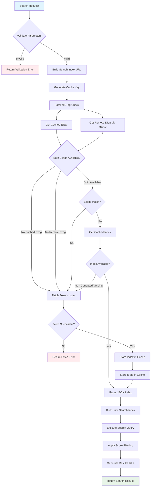

# SearchDocs Tool

## Overview

The `searchDocs` tool provides search capabilities across Powertools for AWS Lambda documentation for multiple runtime environments. It fetches search indices from the documentation and performs full-text search using Lunr.js.

## Features

- **Multi-runtime Support**: Search across Python, TypeScript, Java, and .NET documentation
- **Version-aware Search**: Support for specific versions or latest documentation (Python/TypeScript only)
- **Full-text Search**: Uses Lunr.js for tokenized search with relevance scoring
- **File-based Caching**: Uses disk cache to minimize network requests
- **Confidence Filtering**: Filters results based on configurable confidence threshold

## Parameters

The tool accepts the following parameters:

### Required Parameters

| Parameter | Type     | Description                               | Example                                                |
| --------- | -------- | ----------------------------------------- | ------------------------------------------------------ |
| `search`  | `string` | The search query to find in documentation | `"Logger"`, `"batch processor"`, `"metrics decorator"` |
| `runtime` | `enum`   | The runtime environment to search in      | `"python"`, `"typescript"`, `"java"`, `"dotnet"`       |

### Optional Parameters

| Parameter | Type     | Default    | Description                                 | Example               |
| --------- | -------- | ---------- | ------------------------------------------- | --------------------- |
| `version` | `string` | `"latest"` | Semantic version (x.y.z format) or "latest" | `"2.1.0"`, `"latest"` |

### Parameter Validation

- **search**: Must be a non-empty string after trimming whitespace
- **runtime**: Must be one of the supported runtimes: `java`, `dotnet`, `typescript`, `python`
- **version**: String value (defaults to `latest`); versioning only supported for Python and TypeScript

## Flow Diagram



## How It Works

1. **Parameter Validation**: Validates search query, runtime, and version parameters
2. **URL Construction**: Builds the search index URL based on runtime and version
3. **Index Fetching**: Fetches the MkDocs search index using cached HTTP requests
4. **Index Building**: Creates a Lunr.js search index from the fetched data
5. **Search Execution**: Performs full-text search with title boosting (10x)
6. **Result Filtering**: Filters results by confidence threshold (configurable via `SEARCH_CONFIDENCE_THRESHOLD`)
7. **URL Generation**: Constructs full documentation URLs for each result

## Caching

The tool uses disk-based caching via the `fetchWithCache` utility:

- **Cache Location**: System temp directory (`/tmp/powertools-mcp` by default)
- **Cache Strategy**: ETag-based caching with automatic invalidation
- **Performance**: Subsequent requests for the same search index are served from cache
- **Configuration**: Cache path configurable via `CACHE_BASE_PATH` environment variable

## Usage Examples

### Basic Search

```json
{
  "search": "Logger",
  "runtime": "python"
}
```

### Version-Specific Search

```json
{
  "search": "batch processor",
  "runtime": "typescript",
  "version": "2.1.0"
}
```

### Feature Discovery

```json
{
  "search": "idempotency decorator",
  "runtime": "python",
  "version": "latest"
}
```

## Response Format

### Successful Response

```json
[
  {
    "location": "https://docs.powertools.aws.dev/lambda/python/latest/core/logger/",
    "score": 15.234
  }
]
```

### Error Response

```json
{
  "content": "Failed to fetch search index for python latest: Network error",
  "isError": true
}
```

## Implementation Details

### Search Algorithm

1. **Full-text Search**: Uses Lunr.js for tokenized search
2. **Field Boosting**: Title matches receive 10x score boost
3. **Score Filtering**: Results below confidence threshold are excluded
4. **Early Termination**: Stops processing when score drops below threshold (results are sorted)

### URL Generation

Runtime-specific URL patterns:

- **Python/TypeScript**: `https://docs.powertools.aws.dev/lambda/{runtime}/{version}/search/search_index.json`
- **Java/.NET**: `https://docs.powertools.aws.dev/lambda/{runtime}/search/search_index.json`

Result URLs:

- **Python/TypeScript**: `{baseUrl}/{document.location}`
- **Java/.NET**: `{baseUrl}/{document.location}`

### Configuration

- **Confidence Threshold**: Configurable via `SEARCH_CONFIDENCE_THRESHOLD` environment variable (default: 30)
- **Fetch Timeout**: 15 seconds for all HTTP requests
- **Cache Path**: Configurable via `CACHE_BASE_PATH` environment variable

### Error Handling

- Network connectivity issues
- Malformed search indices
- Invalid search index format
- Search execution failures

### Security

- **Domain Restriction**: Only fetches from `docs.powertools.aws.dev`
- **Input Validation**: Parameters validated using Zod schemas
- **Timeout Protection**: 15-second timeout for all network requests

## Files

- `tool.ts`: Main tool implementation and search logic
- `schemas.ts`: Parameter validation schemas  
- `types.ts`: TypeScript type definitions
- `constants.ts`: Tool metadata
- `index.ts`: Tool export
