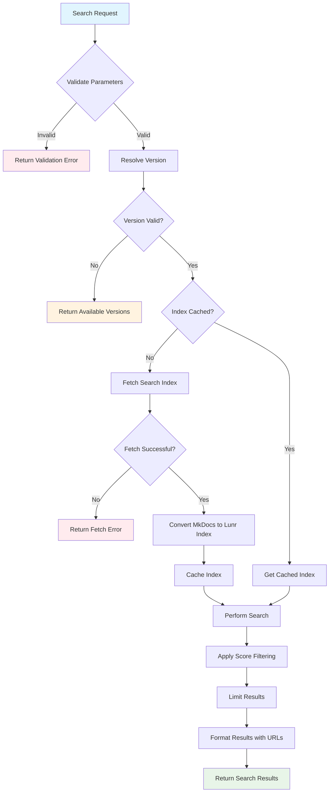

# SearchDocs Tool

## Overview

The `searchDocs` tool provides intelligent search capabilities across AWS Lambda Powertools documentation for multiple runtime environments. It enables users to quickly find relevant documentation, examples, and best practices by searching through indexed content from the official Powertools documentation.

## Features

- **Multi-runtime Support**: Search across Python, TypeScript, Java, and .NET documentation
- **Version-aware Search**: Support for specific versions or latest documentation
- **Intelligent Ranking**: Uses Lunr.js for full-text search with relevance scoring
- **Optimized Results**: Smart filtering and snippet generation for better readability
- **In-memory Caching**: Efficient caching strategy to minimize network requests
- **Error Handling**: Comprehensive validation and error reporting

## Parameters

The tool accepts the following parameters:

### Required Parameters

| Parameter | Type | Description | Example |
|-----------|------|-------------|---------|
| `search` | `string` | The search query to find in documentation | `"Logger"`, `"batch processor"`, `"metrics decorator"` |
| `runtime` | `enum` | The runtime environment to search in | `"python"`, `"typescript"`, `"java"`, `"dotnet"` |

### Optional Parameters

| Parameter | Type | Default | Description | Example |
|-----------|------|---------|-------------|---------|
| `version` | `string` | `"latest"` | Semantic version (x.y.z format) or "latest" | `"2.1.0"`, `"latest"` |

### Parameter Validation

- **search**: Must be a non-empty string after trimming whitespace
- **runtime**: Must be one of the supported runtimes: `python`, `typescript`, `java`, `dotnet`
- **version**: Must follow semantic versioning format (x.y.z) or be "latest"

## Flow Diagram



## Caching Strategy

The searchDocs tool implements a sophisticated multi-level caching strategy to optimize performance and reduce network overhead:

### 1. In-Memory Index Cache

- **Storage**: `Map<string, SearchIndex>` in the `SearchIndexFactory` class
- **Key Format**: `{runtime}-{version}` (e.g., `python-2.1.0`, `typescript-latest`)
- **Lifetime**: Session-based (cleared when server restarts)
- **Content**: Complete Lunr search index and optimized document map

### 2. Version Resolution Cache

- **Purpose**: Caches available versions for each runtime
- **Benefit**: Reduces API calls to `versions.json` endpoints
- **Implementation**: Implicit caching through the version resolution process

### 3. Document Optimization

The tool optimizes memory usage by storing only essential document data:

```typescript
// Cached document structure (minimal footprint)
{
  title: string,           // Document title
  location: string,        // Document path/URL
  preview: string,         // First 200 characters + "..."
  tags: string[]          // Optional tags
}
```

### 4. Cache Invalidation

- **Manual**: No explicit cache invalidation (session-based)
- **Automatic**: Cache is cleared when the MCP server restarts
- **Strategy**: Cache-aside pattern - fetch on miss, store on successful retrieval

### 5. Performance Benefits

- **First Request**: ~500-2000ms (network fetch + index building)
- **Subsequent Requests**: ~10-50ms (memory lookup + search)
- **Memory Usage**: ~1-5MB per cached runtime/version combination
- **Network Savings**: 99%+ reduction in repeated fetch requests

### 6. Cache Key Strategy

```typescript
protected getCacheKey(runtime: string, version = 'latest'): string {
  return `${runtime}-${version}`;
}
```

Runtime-specific version handling:
- **Python/TypeScript**: Version-specific URLs and caching
- **Java/.NET**: Single "latest" version (no versioning yet)

## Usage Examples

### Basic Search
```json
{
  "search": "Logger",
  "runtime": "python"
}
```

### Version-Specific Search
```json
{
  "search": "batch processor",
  "runtime": "typescript",
  "version": "2.1.0"
}
```

### Feature Discovery
```json
{
  "search": "idempotency decorator",
  "runtime": "python",
  "version": "latest"
}
```

## Response Format

### Successful Response
```json
[
  {
    "title": "Logger - Powertools for AWS Lambda (Python)",
    "url": "https://docs.powertools.aws.dev/lambda/python/2.1.0/core/logger/",
    "score": 15.234,
    "snippet": "Logger provides a custom logging handler that formats logs..."
  }
]
```

### Error Response
```json
{
  "error": "Invalid version: 1.0.0 for runtime: python",
  "availableVersions": ["2.1.0", "2.0.0", "1.9.0"]
}
```

## Implementation Details

### Search Algorithm

1. **Full-text Search**: Uses Lunr.js for tokenized, stemmed search
2. **Field Boosting**: Title matches receive 10x score boost
3. **Score Filtering**: Results within 10 points of top score
4. **Result Limiting**: Maximum 10 results per search
5. **Snippet Generation**: Truncated previews for better readability

### URL Generation

Different runtimes have different URL patterns:

- **Python/TypeScript**: `https://docs.powertools.aws.dev/lambda/{runtime}/{version}/{path}`
- **Java/.NET**: `https://docs.powertools.aws.dev/lambda/{runtime}/{path}`

### Error Handling

The tool provides comprehensive error handling for:

- Invalid runtime specifications
- Unsupported or non-existent versions
- Network connectivity issues
- Malformed search indices
- Search execution failures

### Security Considerations

- **Domain Restriction**: Only fetches from `docs.powertools.aws.dev`
- **Input Validation**: All parameters are validated using Zod schemas
- **Timeout Protection**: 15-second timeout for all network requests
- **Error Sanitization**: Error messages are sanitized before return

## Architecture Components

### Core Classes

- **SearchIndexFactory**: Manages index caching and version resolution
- **Tool Function**: Main entry point and orchestration logic
- **Search Functions**: Lunr integration and result processing

### Key Files

- `tool.ts`: Main tool implementation and error handling
- `searchIndex.ts`: Index management, caching, and search logic
- `schemas.ts`: Parameter validation schemas
- `types.ts`: TypeScript type definitions
- `constants.ts`: Tool metadata and configuration

## Performance Characteristics

### Benchmarks (Typical)

- **Cold Start**: 500-2000ms (first search per runtime/version)
- **Warm Search**: 10-50ms (cached index)
- **Memory Footprint**: 1-5MB per cached index
- **Network Efficiency**: 99%+ cache hit rate after initial load

### Scalability

- **Concurrent Searches**: Fully thread-safe for read operations
- **Memory Growth**: Linear with number of cached runtime/version combinations
- **Index Size**: Optimized document storage reduces memory by ~60%

## Troubleshooting

### Common Issues

1. **Version Not Found**: Check available versions using invalid version error response
2. **Network Timeouts**: Verify connectivity to `docs.powertools.aws.dev`
3. **Empty Results**: Try broader search terms or check runtime compatibility
4. **Memory Issues**: Restart MCP server to clear cache if needed

### Debug Information

The tool provides detailed logging for troubleshooting:
- Version resolution steps
- Cache hit/miss information
- Search result counts and timing
- Network request status